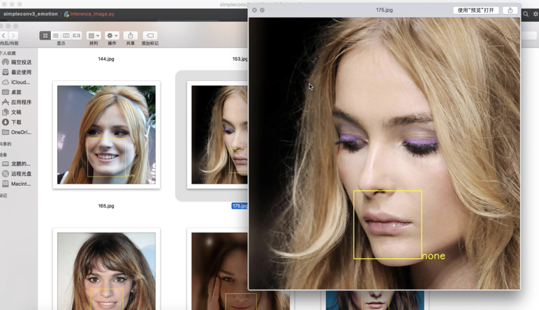
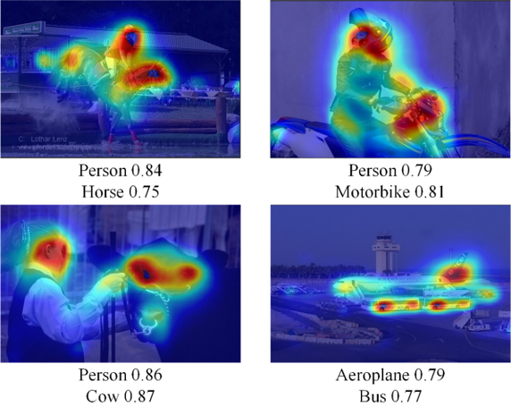
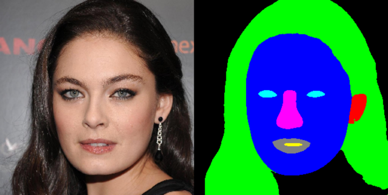
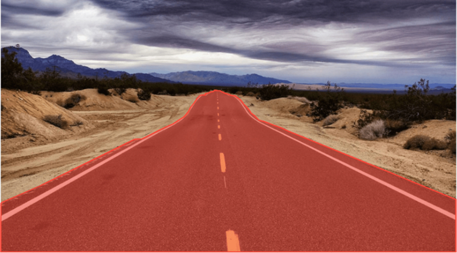
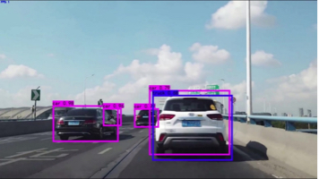
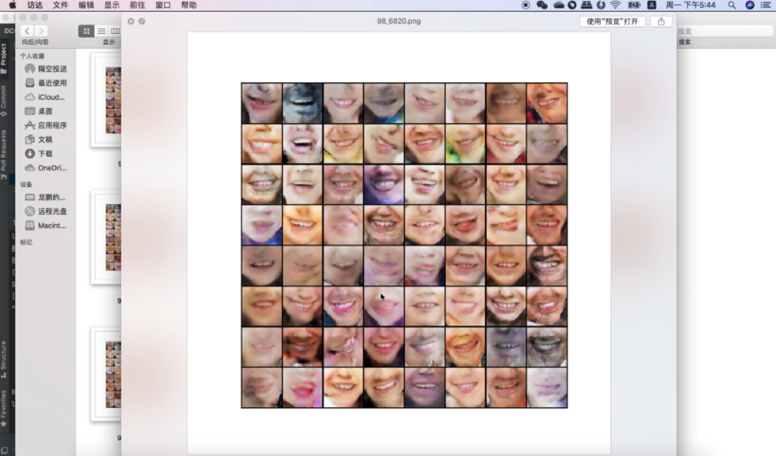
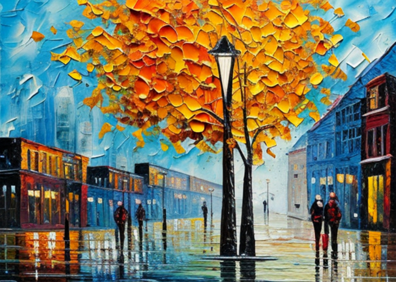
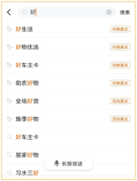

# AI projects

## 1. Facial expression recognition

## 2. Multi-label image recognition of daily necessities in smart cities

## 3. Face and hair segmentation

## 4. Drivable road surface segmentation in autonomous driving

## 5. Autonomous driving open road vehicle detection

## 6. DCGAN face and lip image generation

## 7. Stable Diffusion model image generation

## 8. 3DCNN model video action recognition

## 9. Chatbot

## 10. Practical implementation of key algorithms for search recommendation in vertical fields

# Useful Links

## **[annotated_deep_learning_paper_implementations](https://github.com/labmlai/annotated_deep_learning_paper_implementations)**

https://github.com/labmlai/annotated_deep_learning_paper_implementations/tree/master

https://www.zhihu.com/question/352525266/answer/3356272708?utm_psn=1844183092929114112
